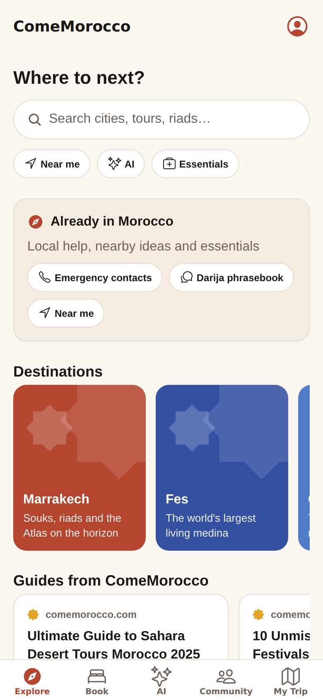
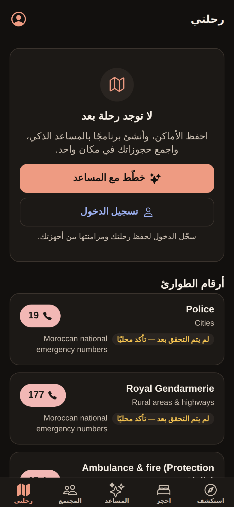

# ComeMorocco

The ComeMorocco platform: a Morocco travel companion that helps people discover, plan, book,
experience and share Morocco. The mobile app (iOS + Android) is its first client, alongside
[comemorocco.com](https://comemorocco.com).

- **Specification:** [`docs/MASTER_PLAN.md`](docs/MASTER_PLAN.md)
- **Architecture:** [`docs/architecture.md`](docs/architecture.md)
- **Milestone status:** [`docs/foundation-v0.1.md`](docs/foundation-v0.1.md)
- **AI audit:** [`docs/ai-audit.md`](docs/ai-audit.md)

| | |
|---|---|
|  |  |
|  |  |

## Repository

```
apps/mobile               Expo (SDK 57) app — Explore · Book · AI · Community · My Trip
apps-admin/admin          internal admin (planned)
apps-provider/…           provider portal (planned)
services/ai               ComeMorocco AI (FastAPI) — the existing agent + provider fallback chain
workers/platform          Cloudflare Worker — /go affiliate redirects, /v1/content
packages/shared           versioned API contracts (zod), AI client, action authorization
packages/i18n             en · fr · ar (RTL) · es
packages/ui               design tokens (light/dark, WCAG AA tested)
supabase                  migrations (RLS on every table), seeds, RLS tests
scripts                   catalog generator, Supabase test runner, secret scan
```

## Run it locally

Requirements: Node 22 + pnpm 10, Python 3.11+, PostgreSQL 16 client (for the DB tests).

```bash
pnpm install

# 1. AI service → http://localhost:8000
cd services/ai
python3 -m venv .venv && . .venv/bin/activate
pip install -r requirements-dev.txt
cp .env.example .env          # add OPENROUTER_API_KEY, CLOUDFLARE_*, WORKERS_AI_MODEL
make run

# 2. Platform worker → http://localhost:8787
cd workers/platform && pnpm dev

# 3. App → scan the QR code with Expo Go, or press w for web
cd apps/mobile && cp .env.example .env.local && pnpm start
```

Without any keys, everything still runs: the AI answers with its fallback message, but it still
returns article and partner cards, the worker logs clicks to the console, and the app runs in guest
mode with the bundled catalog.

## Checks (also run in CI)

```bash
pnpm typecheck && pnpm lint && pnpm test
python3 scripts/generate_catalog.py --check
scripts/test-supabase.sh
node scripts/scan-secrets.mjs
cd services/ai && pytest -q && make eval-gate && python scripts/export_contract_examples.py --check
```

## Secrets

Secrets only ever live in `services/ai/.env`, `workers/platform/.dev.vars` (both gitignored), and the
hosting providers' secret stores. The app only receives public `EXPO_PUBLIC_*` values.
`scripts/scan-secrets.mjs` fails CI if a key-shaped string is committed.
