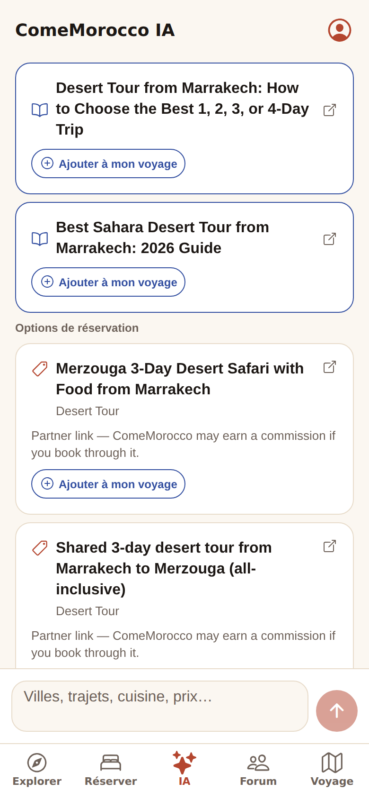
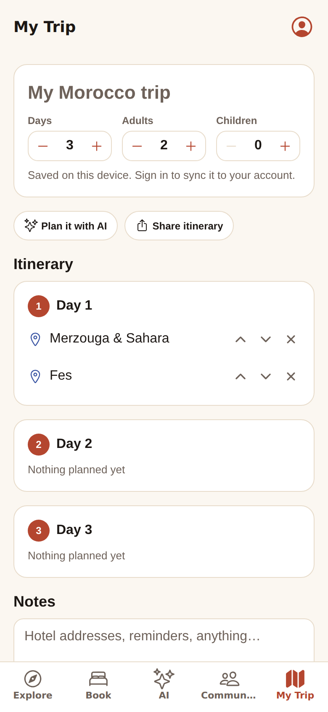
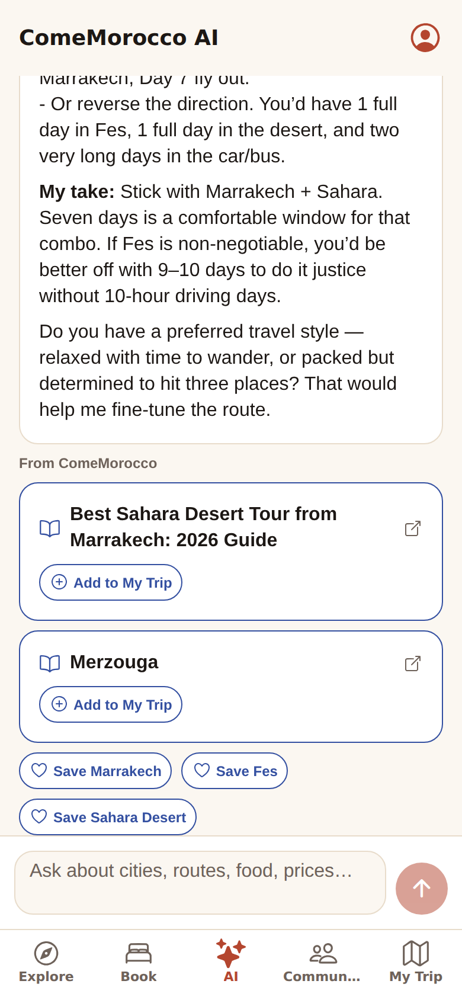

# Milestone v0.2 — status

Master Plan phases touched: **2** (content/Explore), **4** (AI integration), **5** (My Trip).
Built as vertical slices (§51): each has storage → API/contract → app → tests.

| | Screens |
|---|---|
|  |  |

## What shipped

### 1. AI language quality (Phase 4)
- **The bug.** French and Spanish questions missed the English content, and the intent and affiliate rules. `app/core/lexicon.py` fixes this with a deterministic bridge:
  - accent folding
  - English equivalents of known travel phrases
  - "de X à Y" routes

  It applies only to messages detected as French or Spanish, so English behaviour is unchanged.
- **Fallback messages** are now in English, French, Spanish, Arabic and Darija.
- **A pre-existing English bug was found and fixed:** "desert tour from Marrakech" offered waterfall day trips.
- **Evidence:** `tests/test_multilingual.py`, 18 cases, all of which failed before the change. The eval is unchanged.

### 2. My Trip, local-first (Phase 5)
- **Pure model** (`apps/mobile/src/lib/trip-model.ts`):
  - days, ideas, reorder across days, day-count changes that never lose items
  - saved places, a share-as-text itinerary, AI trip context
  - row mapping onto the Supabase tables, tested against the migration's actual columns
- **Store** (`trip-store.tsx`):
  - guests plan on the device
  - signed-in travellers sync through `sync_trip()`, which is atomic and RLS-checked; a device trip is uploaded on first sign-in
- **UI:**
  - the Trip tab: name, days and travellers steppers, a day-by-day itinerary with up/down reorder, ideas you plan onto a day, notes, saved places, share, and delete with confirmation
  - "Add to My Trip" and save (heart) buttons on listings, destination tiles and destination pages
- **Database:** migration `20260930000004_trip_sync.sql`, with RLS tests where a user syncs their own trip and another user fails to overwrite it.

### 3. AI trip context + validated actions (Phase 4, §13–14, §19–20)
- **Trip context in.** `ChatRequest.trip_context` carries the traveller's trip. It fills gaps in the conversation's trip state and never overrides what the traveller said (exclusions win).
- **Proposals out.** `ChatResponse.actions` / stream `meta.actions`: `add_to_trip` for each selected card, and `save_place` for detected destinations. They're built by code, the service never writes user data, and nothing is proposed for off-topic, safety or problem messages.
- **App side.** Each action becomes a button. A tap goes through `authorizeToolCall` (schema, permission, `userRequested`), and only then runs against the trip store. A `deviceLocal` rule lets guests write their own on-device trip; payments still require an account and confirmation.
- **Cross-language guard.** A contract test takes the actions the real service proposes and checks that each passes the app's validator.

### 4. Content polish (Phase 2)
- Destination taglines in en/fr/ar/es (catalog, seed, and `destinations.tagline` → jsonb migration).
- Explore's fallback guides are ordered by the traveller's onboarding interests.
- French and Spanish tab labels shortened (Forum / Voyage / Foro) so all five fit at phone width; web tab bar no longer clips labels.

## Verification
| Check | Result |
|---|---|
| AI tests | 180 passed (153 → 180) |
| AI eval gate | affiliate 0.958 · link 1.000 · live-data 0.638 · retrieval 0.378 (unchanged) |
| TypeScript: typecheck, lint | ✅ all packages |
| TypeScript tests | ui 28 · i18n 5 · shared 19 · worker 12 · mobile 21 |
| Supabase migrations + RLS (empty Postgres 16) | ✅ including trip-sync ownership and localized taglines |
| Contract examples regenerated from the real service and checked on both sides | ✅ |
| Secret scan | ✅ |
| Browser end-to-end (Playwright against the running AI service, worker and Expo web) | **15/15** — see below |

End-to-end checks (`scratchpad/e2e-v02.mjs`, run against the live local stack):
- French desert question → Sahara/desert guides, no hammam guide, desert-tour partner cards, French fallback text
- 4 "Add to My Trip" actions shown; tapping one marks it "in your trip" and it appears on the Trip tab, persisting across reload
- building a trip from destination pages, planning ideas onto Day 1 and reordering them
- the trip is sent to the AI as `trip_context`
- the Arabic tagline shows on the destination page in dark mode

## Live verification with the real keys (2026-09-30, after network access was opened)

Your OpenRouter and Cloudflare keys work, and comemorocco.com's live articles come through the worker.
The first live runs found four problems that no offline test had caught. All four are fixed and now have tests:

| Found live | Cause | Fix + test |
|---|---|---|
| "Marrakech or Fes for a first trip?" linked *Flights to Marrakech* | Orchestrator appended trip cities the question already named, doubling them (pre-existing) | Only new trip context is appended; `tests/test_orchestrator_retrieval.py` runs every annotated case through the real orchestrator path (failed before the fix) |
| Links changed between server restarts | Top-8 term selection broke IDF ties by random set order (pre-existing) | Alphabetical tie-break; CI runs retrieval under two fixed hash seeds |
| Workers AI first in the chain → "400 No route for that URI" | Router forced the OpenRouter model id onto Cloudflare (v0.1 router bug) | Model overrides only apply to the configured provider kind; regression test |
| 57–114 s answers, raw "thinking" or gibberish text | Free Nemotron is a reasoning model; `effort: low` still thinks | `OPENROUTER_REASONING_EFFORT=off` (reasoning disabled, ~4 s); router skips a provider with no first token in 10 s, and holds back the first 120 characters so garbled output switches provider before anyone sees it |

The chain in use now: OpenRouter Nemotron free (reasoning off) → Workers AI Mistral Small 24B → Workers AI Llama 4 Scout.
Five live questions in English, French, Spanish and Arabic all came back clean. When OpenRouter stalled, the switch to Mistral happened automatically, with first words in 1.4–2.5 s.

**Free-tier capacity:**
- OpenRouter free allows about 50 requests a day, or 1,000 a day after a one-time $10 credit.
- The Workers AI free allowance is about 10k Neurons a day, roughly 130 Mistral answers.

That is enough for development and a soft launch. Plan a paid model or credit before a public launch.

## Live Supabase project (2026-09-30)
- **Setup.** The project was created with `supabase/setup/all-in-one.sql`, which reported 11 destinations and 77 listings.
- **App configuration.** The app reads the project URL and the publishable key from the gitignored `apps/mobile/.env.local`. The AI service verifies signed-in travellers against the project's JWKS (ES256) through `SUPABASE_URL`. The secret key is never used.
- **Live checks.** `node scripts/check-supabase-live.mjs` passes against the live project:
  - public catalogue readable
  - trips, profiles, bookings and AI history invisible to guests
  - analytics, affiliate clicks and audit log denied to guests
  - `sync_trip` refused without an account
  - With `SUPABASE_TEST_ACCESS_TOKEN` it also round-trips a trip for a signed-in user.
- **Sign-in.** It now accepts the 6-digit code from the email as well as the link, so it works without deep-link setup. This needs `{{ .Token }}` in the Supabase "Magic Link" email template.
- **Fixed.**
  - With Supabase configured, web server rendering crashed because it read the session from browser storage. The client is now skipped during server rendering.
  - Destination tiles nested the save button inside the tile button, which is invalid on web. It's now a sibling.
